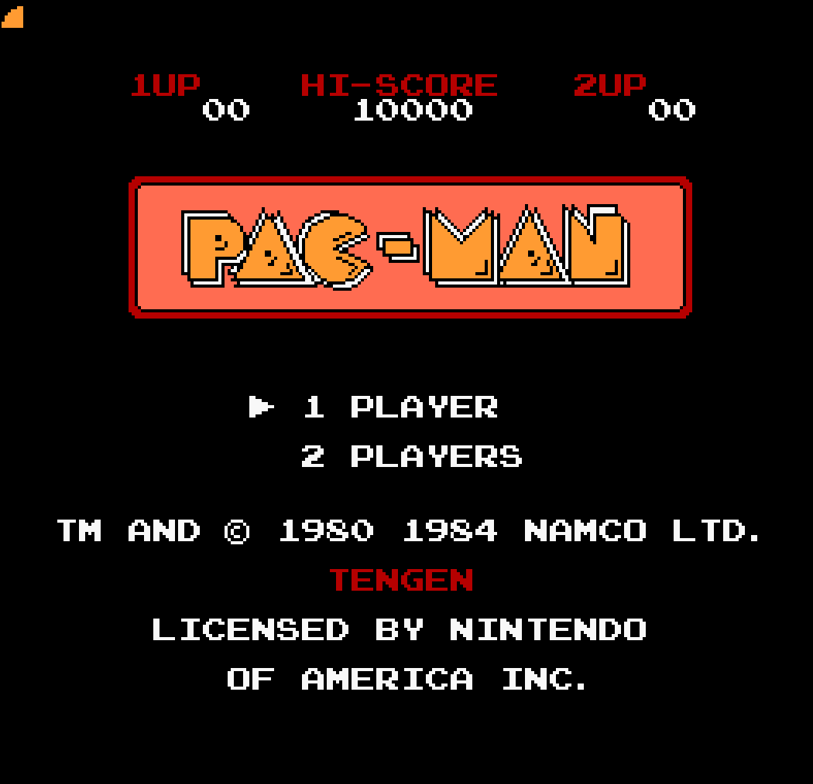
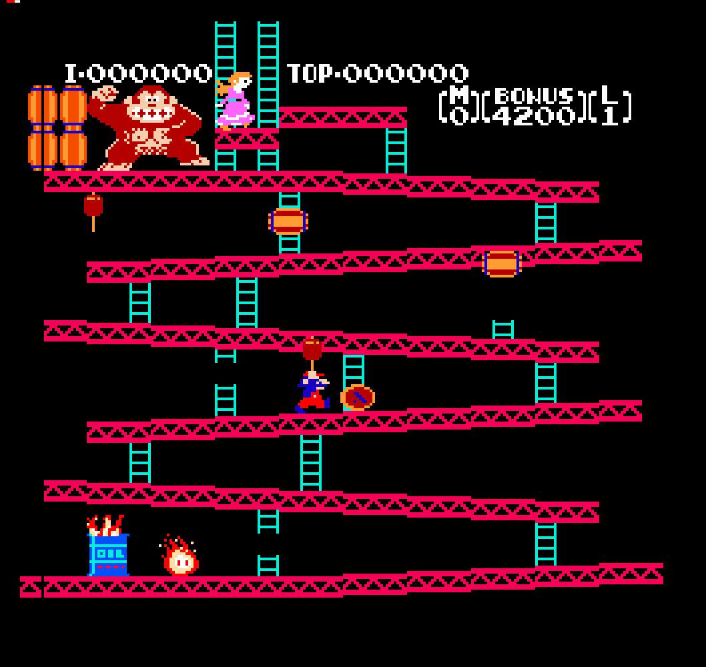

# Nez

An emulator for the Nintendo Entertainment System made using zig and raylib.
The emulation is cycle accurate (as accurate as I could make it),
and the code well commented and avoids any clever optimizations.
The project is  meant to serve as an example to anyone wanting to write their own. 

<div style="display: flex; gap: 10px;">
    
    
</div>

## Usage

Make sure you have a ROM file in the iNES format.
Some people download ROMs from piracy websites such as [this one](https://www.emulatorgames.net/roms/nintendo/).
Of course, I would never recommend that ;)

To launch a ROM from the command line:

```
nez path/to/rom.nes 
```

To see debug info while playing the games:

```
nez --debug path/to/rom.nes
```

Controls:

| Controller         | Keyboard   |
|--------------------|------------|
| A                  | Q          |
| B                  | E          |
| Start              | Enter      |
| Select             | X          |
| Up/Down/Left/Right | Arrow keys |

## Components

### The CPU: Ricoh-2A03

An 8-bit CPU used in a wide variety of game consoles,
the most prominent of them being the NES.

It is a derivative of the MOS-6502 (almost an identical clone), without support for decimal mode.

Resources:

- [Famicom party](https://famicom.party/book/) - This book helped me write my own homebrew ROMs to test.
- [The Obelisk 6502 instruction set reference](https://www.nesdev.org/obelisk-6502-guide/reference.html)
- [Masswerk - 6502 instruction set](https://www.masswerk.at/6502/6502_instruction_set.html)
- [The ultimate 6502 reference](https://www.pagetable.com/c64ref/6502/?tab=2#)

Things to watch out for:
- Zero page wrap around for instructions that use the zero page addressing mode.
- RMW (Read-modify-write) instructions like `ROR` will first write the unmodified byte
  to the memory location, and *then* write the modified byte. This can make a difference
  with some mappers.
- The CPU and PPU must run in sync. For a single CPU cycle, the PPU executes (roughly) three clock cycles.
  A good way to emulate this is to use the delta time between two frames, and then figure out how many cycles
  each chip should execute based on their respective clockspeeds.

If you're feeling adventurous,
and want to write a cycle stepped emulator,
then [this datasheet](https://www.princeton.edu/~mae412/HANDOUTS/Datasheets/6502.pdf) can prove to be useful.

### The PPU: The Ricoh-2C02

Resources:
- [PPU - Nesdev wiki](https://www.nesdev.org/wiki/PPU)
    - You'll have to go over the documents dozens of times before things start making sense.
      There is a lot of information to take in.
- [NES PPU Notes](https://github.com/pjhades/tolarian-academy/blob/master/nes-ppu.md)
- [Austin Morlan - NES rendering overview](https://austinmorlan.com/posts/nes_rendering_overview/)
- [Famicom party](https://famicom.party/book/)

### Bus, Cartridge, Mapper, and other miscellany

Every game comes in a cartridge that contains the game code, assets, and sometimes
extra hardware and battery.

A mapper is a blanket term that describes all kinds of extra hardware present in the circuit that extend the capabilities of the game console.

The **Bus** connects the CPU, PPU, and the Cart, allowing separate components to communicate with each other.

## Building and testing

Clone the repository, then clone all submdoules, and use the zig build command

```sh
zig build run
```

This will open a custom ROM I wrote in debug mode.
To play games, make sure you have a `.nes` file somewhere, and use:
 
 ```sh
 zig build run -- <path-to-rom>
 ```

Oh, and only NROM  games are supported right now. So no contra, duck hunt, ninja gaiden, or darkwing duck, etc.

The CPU has about ~10k test cases for each instruction, coming from [this awesome test repository](https://github.com/TomHarte/ProcessorTests/tree/main/nes6502).
To run the CPU tests, use `zig test src/cpu.zig`.

## TODO

- [x] Support vertical scrolling
- [x] Sprite zero hit
- [x] Support horizontal scrolling
- [x] Support split scrolling
- [x] Add support for the controller
- [ ] Support more mappers
    - [ ] CNROM
    - [ ] UnROM
    - [ ] MMC1
    - [ ] MMC3
    - [ ] MMC5
- [ ] Add support for the APU.
- [ ] Sprite overflow detection (very few games use this feature so not that high priority)

## Motivation

I started out wanting to write a fantasy console,
but didn't want to invent another programming language, compiler, assembler, and then write ROMs in those.
Emulating an existing console sounded like an equally challenging, but more fruitful venture.

